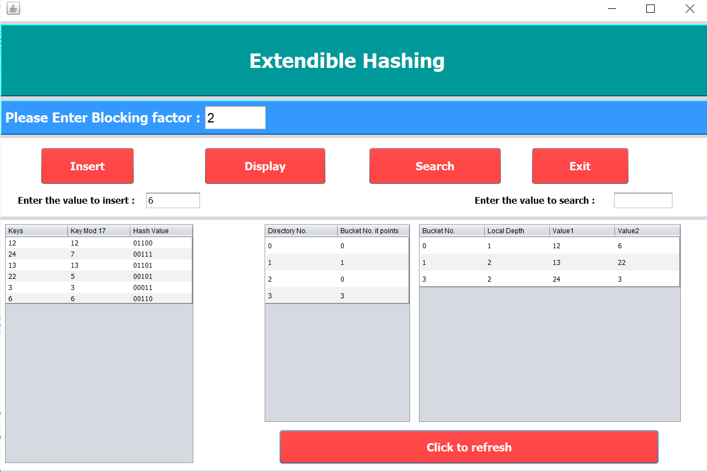

# Extendible-Hashing-with-GUI-Netbeans-
We were asked to create a java based GUI to explain the concept of extendible hashing. 
The application takes the blocking factor as input and created dynamic tables using java. 

 

## About
This scheme stores  a directory structure in addition to the file. This access structure is based on the result of the hash function to the search field.
The major advantage of extendible hashing is that performance does not degrade because of chaining.
In extendible hashing no additional space is wasted towards the allocations for future growth, but additional buckets can be allocated dynamically as needed.
## Usage
Download the code and run the project using netbeans.

Keys : Enter values to be inserted.  
Blocking factor : Maximum number of records in a block.  
Display : Generates tables and shows how records are stored.  
Search : To check is a value is present in database.  

